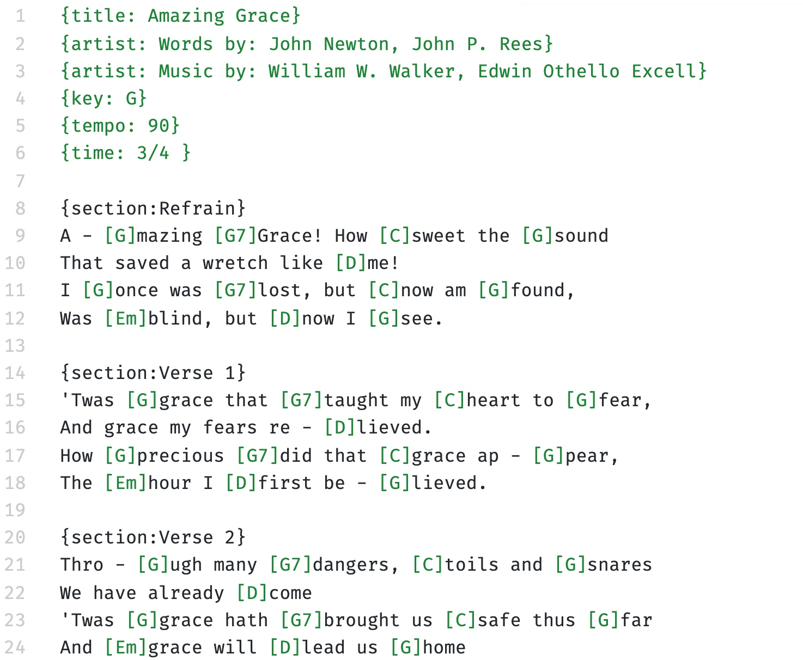
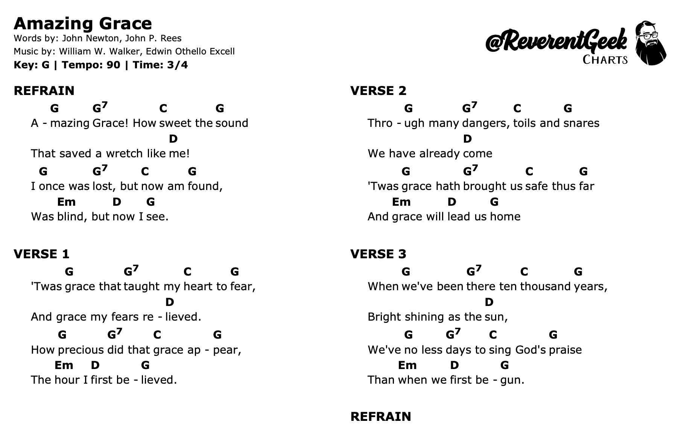

# Charter

Turns `.chordpro` files into formatted HTML chord charts and renders them to PDF.

Turn something like this...



...into something like this!



## Requirements

To use this application, you will need [Node.js](https://nodejs.org/) version 12 or higher.

## Setup

1. Clone or download and unzip the source code.
2. Open your terminal or command prompt and change to the source code folder.
3. Install dependencies

```sh
npm install
```

### Installing the Command-Line Interface (CLI)

The charter application can be installed as a command-line interface (CLI) app that can be used anywhere in your terminal or command prompt.

```sh
npm install -g .
```

This will install the `chord-charter` CLI app.

## Usage

You can use this application to view `.chordpro` files as HTML in the browser and convert them to PDF. A sample ChordPro file is included in the source code.

## Command Line Interface (CLI)

Converting a single ChordPro file to PDF. By default, the `.pdf` file will be saved in the same folder as the ChordPro file.

```sh
chord-charter -f path/to/chartfile.chordpro
```

Specifying the output file.

```sh
chord-charter -f path/to/chartfile.chordpro -o path/to/chordchart.pdf
```

Converting a folder of chordpro files at once. The folder will be scanned for any files ending with a `.chordpro` or `.cho` extension.

```sh
chord-charter -f path/to/chartfiles -o path/to/savepdfs
```

|Option|Description|
|:---|:---|
|`--help`|Show help|
|`--version`|Show version number|
|`-f`, `--source`|Path to file or folder of chordpro files to convert|
|`-o`, `--out`|Path to destination file. If none specified, the file will be saved in the same path as the chordpro file.|
|`--temp`|Specify path to the temp folder for generating intermediate files.|
|`--html`|Save as HTML instead of PDF|
|`--columns`|Use two-column format (doesn't work well with all charts)|

## Advanced Usage

### Converting ChordPro files to PDF

Put your `.chordpro` files in the `charts` folder and run in your terminal:

```sh
npm run start
```

HTML files will be generated in the `build` folder, and PDF files can be found in the `pdf` folder.

### Viewing ChordPro files as HTML

Put your `.chordpro` files in the `charts` folder and run the following in your terminal.

```sh
npm run serve
```

In your browser, navigate to `http://localhost:3000`.

While running, any changes made to `.chordpro` files will be detected and the HTML is rebuilt. Refresh the browser page to see any changes.

> Note: To stop the local web server, go to the terminal window and press `CTRL+C`.

### Converting to PDF with wkHtmltoPDF

There is an option to use [wkhtmltopdf](https://wkhtmltopdf.org/) to perform the final conversion from HTML to PDF. To us it, it must first be installed on your system and in your search path. For macOS, you can install this with [Homebrew](https://brew.sh/) using the following.

> Note: As of this writing, wkhtmltopdf does not support CSS columns, so a two-column chord chart format will not work.

```sh
brew cask install wkhtmltopdf
```

With wkHtmltoPDF installed, use the following npm command to convert all chord files in the `charts` folder and save them to the `pdf` folder.

```sh
npm run wk
```
