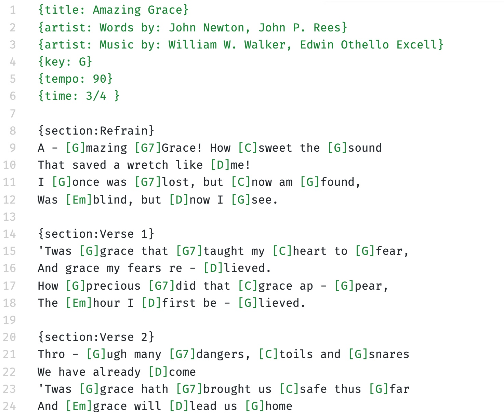
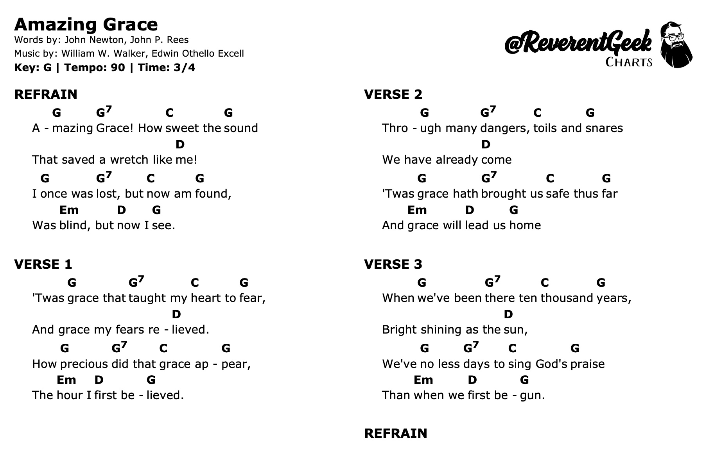

# Charter

Got a folder full of ChordPro files and wish they looked like something you'd actually want on a music stand? Charter turns `.chordpro` and `.cho` files into clean HTML chord charts and renders them to PDF.

It takes something like this...



...and turns it into something like this!



## What you'll need

Before we get started, make sure you have these installed:

- [Node.js](https://nodejs.org/) version 22.16 or higher (22.x), or version 24 or higher
- [pnpm](https://pnpm.io/)
- [Git](https://git-scm.com/)

## Getting set up

1. Clone the source code using Git.
2. Open your terminal or command prompt and change to the source code folder.
3. Install the dependencies.

```sh
pnpm install
```

> **Note:** Cloning matters here! The install step configures a Git hook, so installing from a downloaded zip file will fail.

### Installing the command-line app

If you'd like to use Charter from anywhere in your terminal (and I think you will), install it as a command-line interface (CLI) app.

```sh
npm install -g .
```

Now you have a `chord-charter` command you can run from any folder.

## Using the CLI

Let's make some charts! There's a sample ChordPro file included in the `charts` folder, so you can try things out right away.

```sh
chord-charter -f charts/amazing-grace.chordpro -o amazing-grace.pdf
```

### Convert one file

Point `chord-charter` at a ChordPro file, and you get a PDF. If you don't say where to put it, the `.pdf` file is saved in the same folder as the ChordPro file.

```sh
chord-charter -f path/to/chartfile.chordpro
```

Want to choose the name or location yourself? Add the output file.

```sh
chord-charter -f path/to/chartfile.chordpro -o path/to/chordchart.pdf
```

### Convert a whole folder

You can also convert a folder of charts in one go. Charter picks up every file ending with `.chordpro` or `.cho`. If you leave off the output folder, the PDFs are saved right next to the source files.

```sh
chord-charter -f path/to/chartfiles -o path/to/savepdfs
```

### Save as HTML instead

Prefer to view a chart in the browser? Add `--html`.

```sh
chord-charter -f path/to/chartfile.chordpro --html
```

You'll also find an `assets` folder next to the HTML file. That's the stylesheets and logo the chart needs to look right, so keep them together.

### All the options

|Option|Description|
|:---|:---|
|`--help`|Show help|
|`--version`|Show version number|
|`-f`, `--source`|Path to file or folder of chordpro files to convert (required)|
|`-o`, `--out`|Path to destination file or folder. If none specified, the output will be saved in the same path as the chordpro file(s).|
|`--temp`|Specify path to an existing folder for generating intermediate files. Defaults to a folder in the system temp directory that is removed when finished. Ignored when using `--html`.|
|`--html`|Save as HTML instead of PDF|
|`--columns`|Use two-column format (doesn't work well with all charts)|

## Working from the source folder

Don't want to install the CLI? No problem. You can drop your charts into the project and run everything with `pnpm`.

> **Note:** These commands empty the `build` and `pdf` folders before generating new files. If there's a PDF in there you want to keep, move it somewhere safe first!

### Convert your charts to PDF

Put your `.chordpro` or `.cho` files in the `charts` folder and run:

```sh
pnpm start
```

You'll find the HTML files in the `build` folder and the PDFs in the `pdf` folder.

For the two-column format, run this instead:

```sh
pnpm run convert:columns
```

### Preview your charts as HTML

If you only want the HTML (handy when you're tweaking a chart and don't need a PDF every time), put your `.chordpro` or `.cho` files in the `charts` folder and run:

```sh
pnpm run build
```

Open the files in the `build` folder with your browser to take a look. For the two-column format, run `pnpm run build:columns` instead.

## Running the web app

There's also a browser version: paste or open a ChordPro file, see the chart as you type, then print it, save it as a PDF from the print dialog, or download it as a single HTML file. Everything happens in the browser, so charts are never uploaded anywhere. If you paste or open a "chords over text" chart (chords on their own line above the lyrics), it's converted to ChordPro for you.

```sh
pnpm run build:web
```

That creates a static site in the `dist` folder. It needs to be served over HTTP (opening `index.html` straight from disk won't work), so to try it locally:

```sh
npx serve dist
```

Every push to `main` builds the site and deploys it to GitHub Pages (see `.github/workflows/pages.yml`). To host it somewhere else, upload the `dist` folder to any static host.

Happy charting! 🎸
